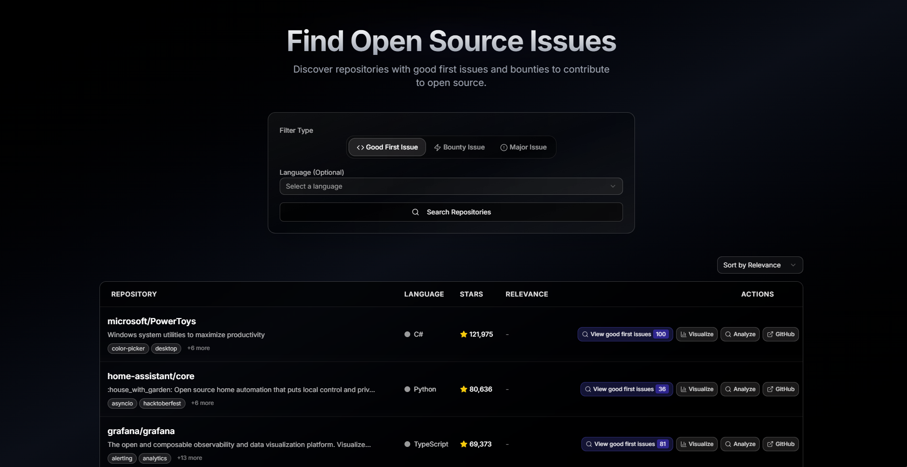

# 🔓 OpenSource Agent

> **Discover beginner-friendly and paid contribution opportunities with secure API authentication + AI-powered insights**  

[](LICENSE)

## ✨ What is OpenSource Agent?

**OpenSource Agent** is a platform that helps developers find the best open-source contribution opportunities.  
It focuses on **open source discovery**—from beginner-friendly issues to paid bounty tasks—and enhances the experience with an **AI Agent** that explains, summarizes, and ranks repositories in natural language.  

The project uses **Descope Outbound Apps** for secure GitHub API authentication, avoiding hardcoded credentials and delivering a seamless user flow.  

---

## 🌟 Key Features

### 🔒 **Secure API Authentication**
- **Descope Outbound Apps** securely authenticate with GitHub API  
- No manual token handling or hardcoded credentials  
- Smooth login & delegation flow  

---

### 🔎 **Open Source Discovery**
- **Good First Issues**: Beginner-friendly contribution opportunities  
- **Bounty Issues**: Paid contribution opportunities  
- **Language Filtering**: Discover projects by programming languages  
- **Categorization**: Browse repositories by type and domain  



---

### 🤖 **AI Agent for Contextual Search & Summarization**
- **Natural Language Search**: Ask in plain English  
  - *“Show me beginner-friendly React projects”*  
- **Smart Summarization**: AI explains issues in plain English  
- **Ranking**: Repos sorted by difficulty, popularity, or activity  
- **Example Output**:  
  > "Here are 3 React repos with active maintainers and beginner-friendly issues.  
  > Repo A has mentorship available, Repo B is trending this month, Repo C has bounty opportunities."  

---

### ⚡ **Seamless Developer Experience**
- One-time setup → secure login → instant opportunities  
- Agent guides you like a mentor  
- Conversational flow reduces manual filtering  

---

## 🛠️ Technology Stack

### **Core**
- **Next.js 15.4.5** – React framework with App Router  
- **React 19.1.0** – Modern UI library  
- **TypeScript** – Type-safe development  

### **UI & Visualization**
- **Tailwind CSS 4.1.11** – Utility-first styling  
- **Framer Motion** – Smooth animations  
- **Radix UI + Lucide React** – Accessible components & icons  

### **APIs & Intelligence**
- **Descope Outbound Apps** – Secure authentication with GitHub  
- **GitHub API** – Repository and issues data  
- **Google Generative AI / LLM** – Summarization, ranking, natural language agent  

---

## 🚀 Getting Started

### Prerequisites
- Node.js 18+  
- A Descope project with Outbound App configured for GitHub  
- GitHub API access  

### Installation

1. **Clone the repository**
```bash
git clone https://github.com/your-org/opensource-agent.git
cd opensource-agent
```

2. **Install dependencies**
```bash
npm install
```

3. **Set up environment variables**
```bash
cp .env.example .env.local
```

Add your API keys and Descope details:  
```env
NEXT_PUBLIC_DESCOPE_PROJECT_ID=your_project_id
NEXT_PUBLIC_DESCOPE_GITHUB_APP_ID=your_outbound_app_id
GOOGLE_AI_API_KEY=your_google_ai_key
```

4. **Run the development server**
```bash
npm run dev
```

5. **Open in browser**  
Navigate to [http://localhost:3000](http://localhost:3000)

---

## 📱 Usage

### Discover Open Source Opportunities
1. Log in securely via Descope  
2. Search for repos & issues by language or category  
3. Use the AI Agent for natural queries and summaries  
   - Example: *“Find Python repos with security-related beginner issues”*  
4. Get ranked recommendations with plain-English explanations  
5. Start contributing directly via GitHub links  

---

## 🏗️ Project Structure

```
opensource-agent/
├── app/                    
│   ├── search/             # Open source issue & repo search
│   └── api/                # API routes
├── components/             # React components
│   ├── ui/                 # UI elements
│   └── page/               # Page-specific components
├── lib/                    
│   ├── descope.ts          # Descope Outbound App integration
│   ├── github.ts           # GitHub API wrapper
│   └── agent.ts            # AI Agent logic (summarization & ranking)
├── config/                 
└── public/                 # Static assets
```

---

## 🤝 Contributing

We welcome contributions!  

1. Fork the repo  
2. Create a branch  
3. Add your changes  
4. Open a PR 🚀  

---

## 📄 License

This project is licensed under the MIT License - see the [LICENSE](LICENSE) file for details.  

---

<div align="center">

  Built with ❤️ using [Descope](https://descope.com) + [GitHub API] + [Google Generative AI]  
  ⭐ Star this repo if you find it helpful!  

</div>  
